### 一、项目简介
##### 本项目旨在通过 Laravel 框架实现一套微服务架构解决方案雏形，以应对高并发、复杂业务逻辑和快速迭代的需求。项目目标是提高系统的可维护性、可扩展性和容错性，同时降低不同服务间的耦合度。

##### 本项目地址 :  https://github.com/utagithub/laravel-in-docker.git


##### 项目架构图


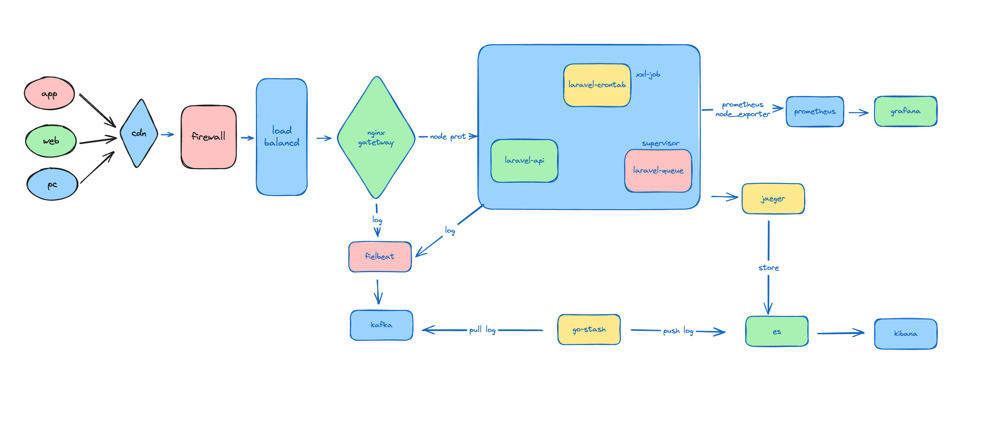


##### 项目目录结构如下:

- data:该项目包含该目录依赖所有中间件(mysql、es、redis、grafana等)产生的数据，此目录下的所有内容应该在git忽略文件中，不需要提交。
- deploy:
    - filebeat: docker部署filebeat配置
    - go-stash:go-stash配置
    - nginx: nginx网关配置
    - prometheus : prometheus配置
    - script:
        - mysql:数据库脚本
- storage
    - supervisor:
        - api: prometheus的node_exporter监控服务,队列监控工具horizon
        - cron: prometheus的node_exporter监控服务,ssh服务
        - queue: prometheus的node_exporter监控服务,laravel应用中的异步队列消费者配置
    - prometheus:该目录下提供了一个容器监控工具和一个grafana监控模版文件,后续有用到，node_exporter是linux_arm_64的，需要特定版本的去下面链接下载
    - https://github.com/prometheus/node_exporter/releases

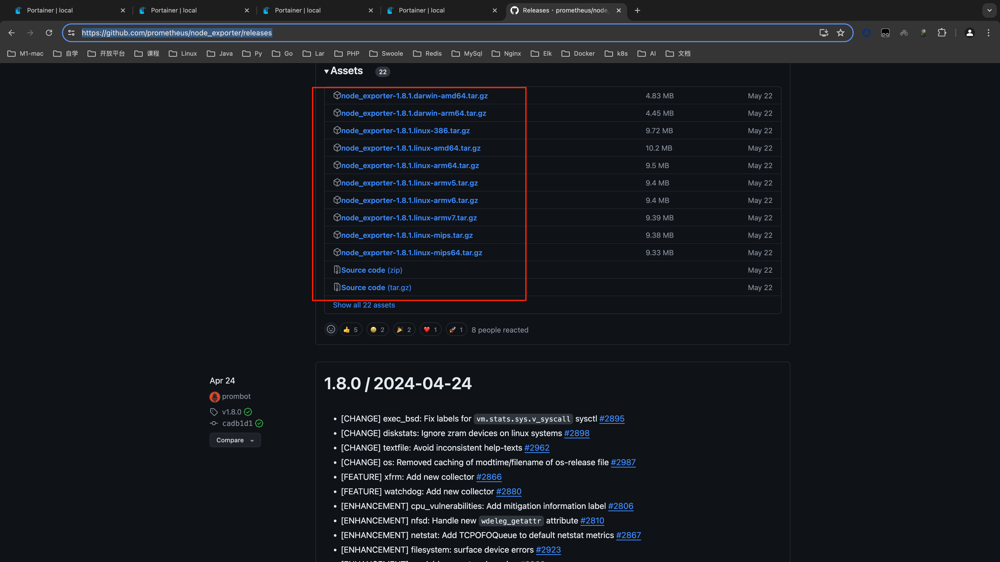


#### 项目中分别提供了一个定时任务和一个异步队列的简单demo,仅供测试

###### 定时任务:app/Console/Commands/TestCommand.php
###### 队列任务:app/Jobs/TestJobQueue.php

​

### 二、用到技术栈

##### Tips : 如果你不熟悉这里面很多技术栈也不要怕，只要你会mysql、redis可以先启动这两个中间件在启动项目先跑起来项目，其他可以慢慢学。


- k8s

- nginx网关

- filebeat

- kafka

- go-stash

- elasticsearch

- kibana

- prometheus

- grafana

- jaeger

- docker

- docker-compose

- mysql

- redis

- xxl-job

- supervisor

- jenkins

- gitlab


​
### 三、项目依赖环境部署

【注意】由于本项目本来中间件比较多，在非linux上启动docker可能会消耗内存较多，建议将物理机分配给docker的内存调到8G+


#### 3.1、clone代码&更新依赖

```shell
$ git clone https://github.com/utagithub/laravel-in-docker.git
$ composer install
$ cp .env.example .env
```

##### Tips :注意local和docker环境下的mysql,redis的配置使用


#### 3.2、启动项目所依赖的环境

```shell
$ docker network create laravel-in-docker-net
$ docker-compose -f docker-compose-ali-env.yml up -d
```


#### 3.3、导入kafka数据

###### 创建kafka topic

项目中是用来Kafka作为日志搜集的中间件需要先创建日志搜集的topic, laravel-in-docker-log 这个topic是日志收集使用的

进入容器

```shell
$ docker exec -it kafka /bin/sh
$ cd /opt/kafka/bin/
$ ./kafka-topics.sh --create --zookeeper zookeeper:2181 --replication-factor 1 -partitions 1 --topic laravel-in-docker-log
```


##### 3.4导入mysql数据

本地工具连接mysql的话要先进入容器，给root设置下远程连接权限

```shell
$ docker exec -it mysql /bin/bash 
$ mysql -uroot -p
##输入密码:PXDN93VRKUm8TeE7
$ use mysql;
$ update user set host='%' where user='root';
$ FLUSH PRIVILEGES;
```

##### 导入xxl-job数据库:/laravel-in-dcoker/deploy/mysql/tables_xxl_job.sql数据(xxl-job数据库)


​
### 四、查看项目依赖服务环境


Elastic search: http://127.0.0.1:9200/ （⚠️:这个启动时间有点长）

jaeger: http://127.0.0.1:16686/search  (⚠️:如果失败了，依赖es，因为es启动时间长这个有可能超时，等es启动玩restart一下)

go-stash :  如果发现kibana点击下一步，就是日志没有收集到，恰巧你的kafka又拿到了数据的话，请restart一下go-stash稍等一分钟即可

kibana  : http://127.0.0.1:5601/

Prometheus: http://127.0.0.1:9090/

Grafana: http://127.0.0.1:3001/  ， 默认账号、密码都是admin

Horizon: http://0.0.0.0:8899/horizon  这个是laravel官方提供的队列监控仪表盘工具

Mysql :  自行客户端工具(Navicat、Sequel Pro)查看

- host : 127.0.0.1

- port : 33070  

- username : root

- pwd : PXDN93VRKUm8TeE7 

Redis :  自行工具（redisInsight）查看 

- host : 127.0.0.1

- port : 36379

- pwd : G62m50oigInC30sf

Kafka:  （发布、订阅｜pub、sub）自行客户端工具查看

- host : 127.0.0.1

- port : 9092


​
### 五、启动服务


##### 5.1 拉取运行环境镜像,启动项目
【注】依赖的是项目根目录下的docker-compose.yml配置
```shell
$ docker-compose up -d 
```

推荐使用portainer管理镜像,容器 所有服务启动如下图所示


​
### 六 配置xxl-job服务

#### 6.1 添加xxl-job任务服务启动后，需要检查laravel-in-docker-cron容器中启动ssh服务是否已经正确启动,后续在xxl-job中添加执行任务的时候会用到ssh服务


```shell
$ docker exec -it xxl-job-executor /bin/bash
$ /etc/init.d/ssh status
```
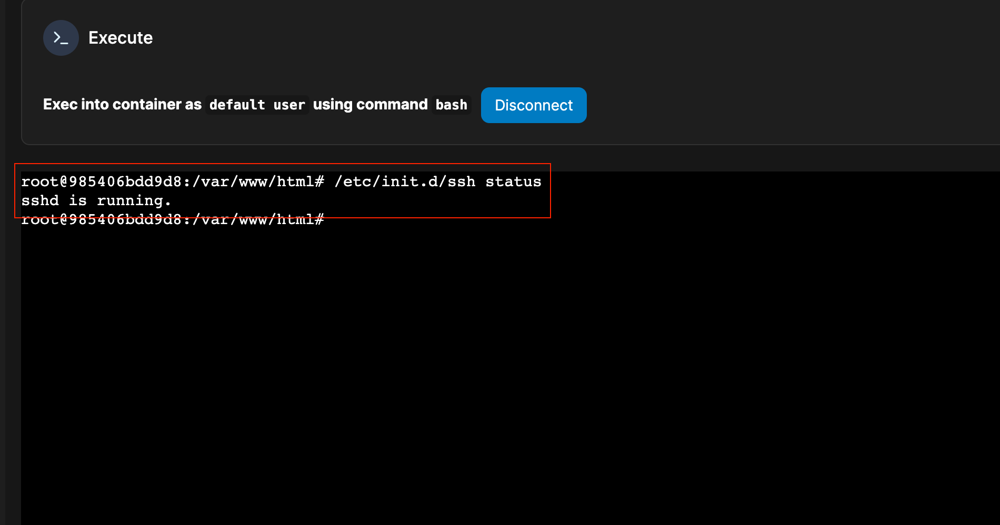


#### 如果没有启动，则执行以下启动命令
```shell
$ /etc/init.d/ssh start
```


##### laravel-in-docker-cron 容器中的ssh服务成功启动后，如果后续在xxl-job中设置的任务没有成功执行,出现下图所示情况

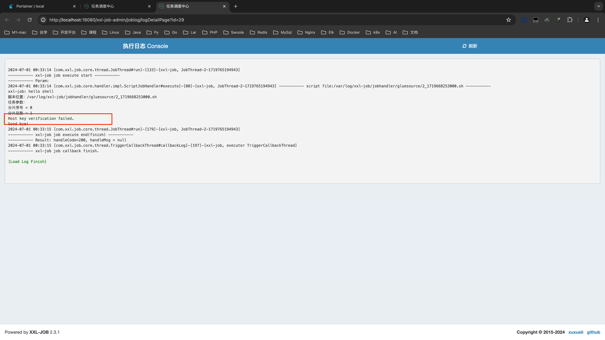

##### 需要在xxl-job的执行器容器xxl-job-executor中手动执行一次远程登陆

```shell
$ docker exec -it xxl-job-executor /bin/bash
$ ssh root@laravel-indocker-cron
```


#### 6.2 登陆xxl-job管理后台

http://0.0.0.0:18080/xxl-job-admin/toLogin

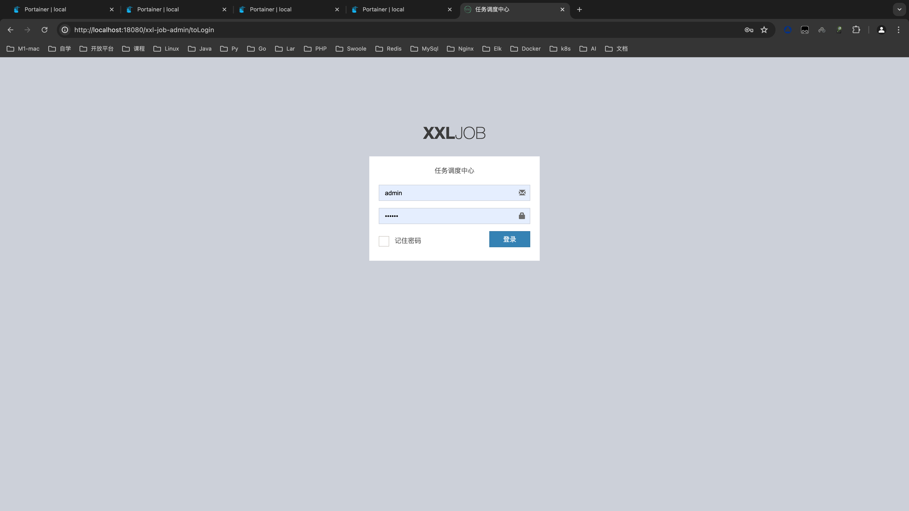

用户名:admin
密码:123456

登陆后如下图


#### 6.3 添加xxl-job任务

任务管理-新增


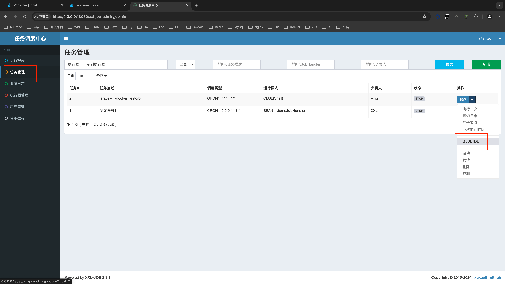


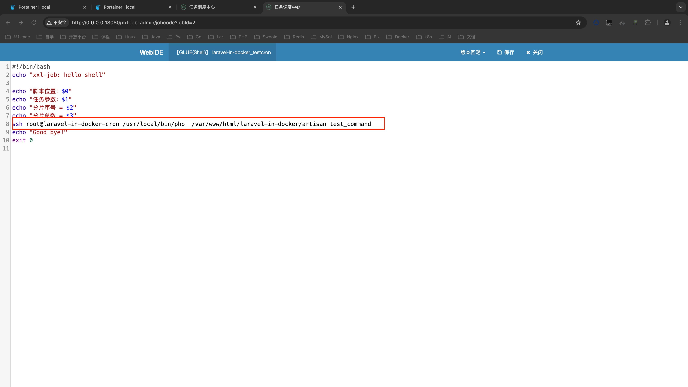


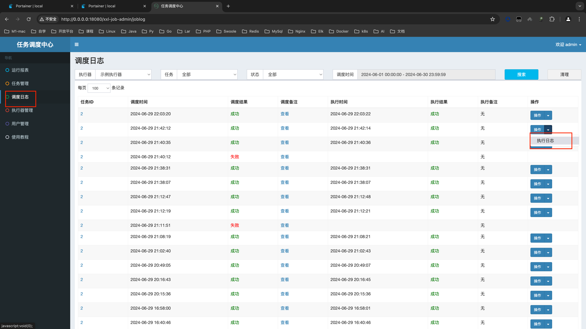


看见下面两张图示内容，说明定时任务在xxl-job中的配置成功


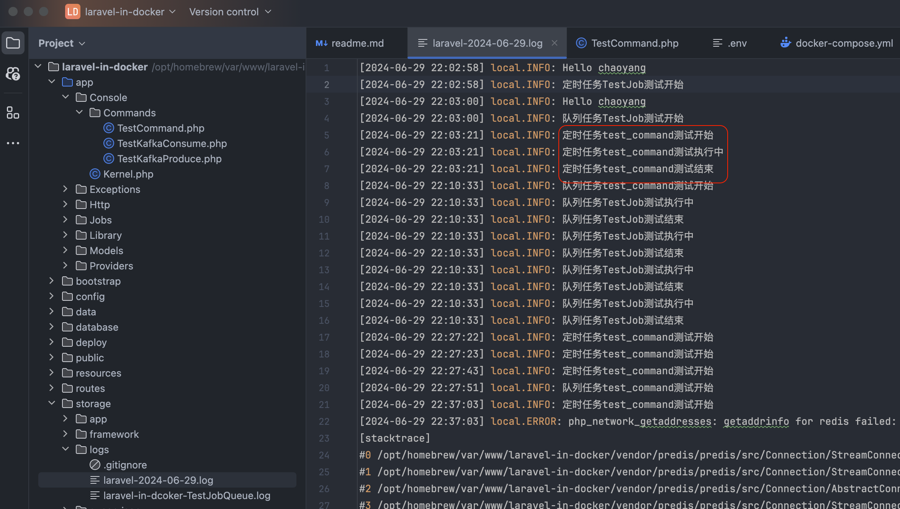


​
### 七、项目监控服务配置


#### 7.1 在prometheus中查看服务运行状态

访问 http://127.0.0.1:9090/ ， 点击上面菜单“Status”，在点击Targets ,蓝色的就是启动成了，红色就是没启动成功

【注】如果是第一次拉取项目，每个项目容器第一次构建拉取依赖，这个看网络情况，可能会稍微比较慢有的服务，这个很正常

```shell
$ docker-compose logs -f 
```

可以看到prometheus也显示成功了，同理把其他的也排查一次，启动成功就可以了


#### 7.2 在grafana中添加prometheus数据源

访问 http://0.0.0.0:3001/

用户名密码默认都是admin


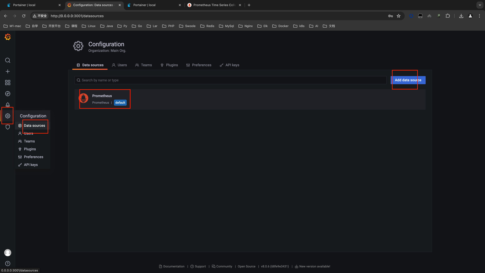


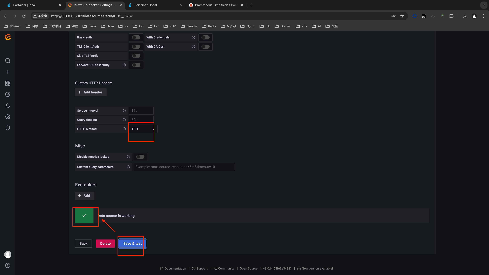


导入数据模版，给大家提前准备好了，文件在/laravl-in-docker/storage/prometheus/Nodes_Compare.json

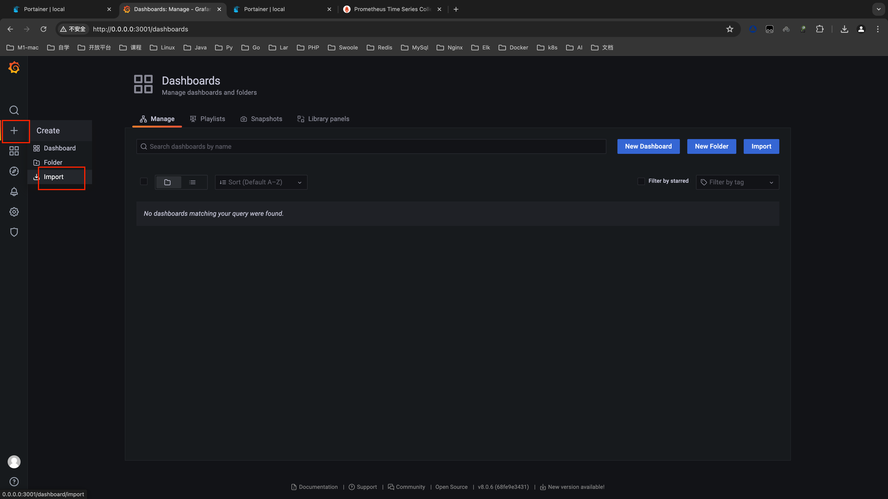

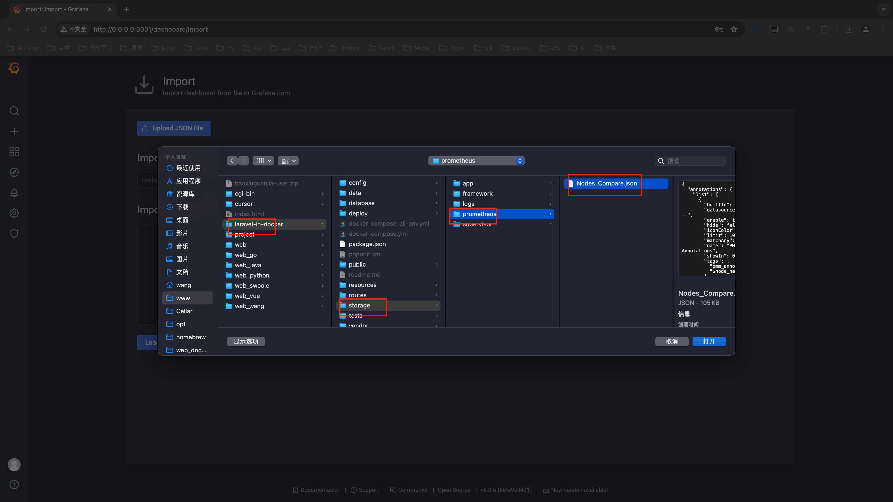

效果图如下:


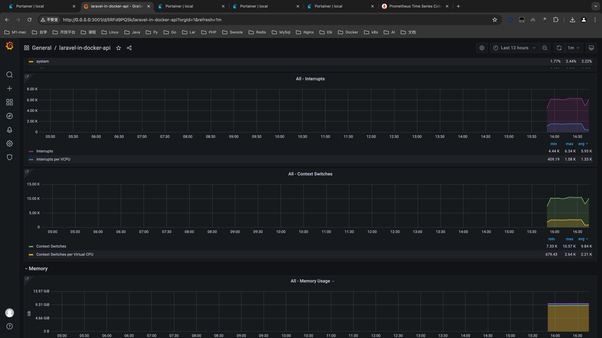


​
### 八、日志收集


将项目日志收集到es（filebeat收集日志->kafka -> go-stash消费kafka日志->输出到es->kibana查看es数据）
由于logstatsh开销过大,使用go-stash作为代替

访问kibana http://127.0.0.1:5601/ ， 创建日志索引


点击左上角菜单(三个横线那个东东) 
然后在当前页面，Create index pattern->输入laravel-in-docker*  -> Next Step ->选择@timestamp->Create index pattern


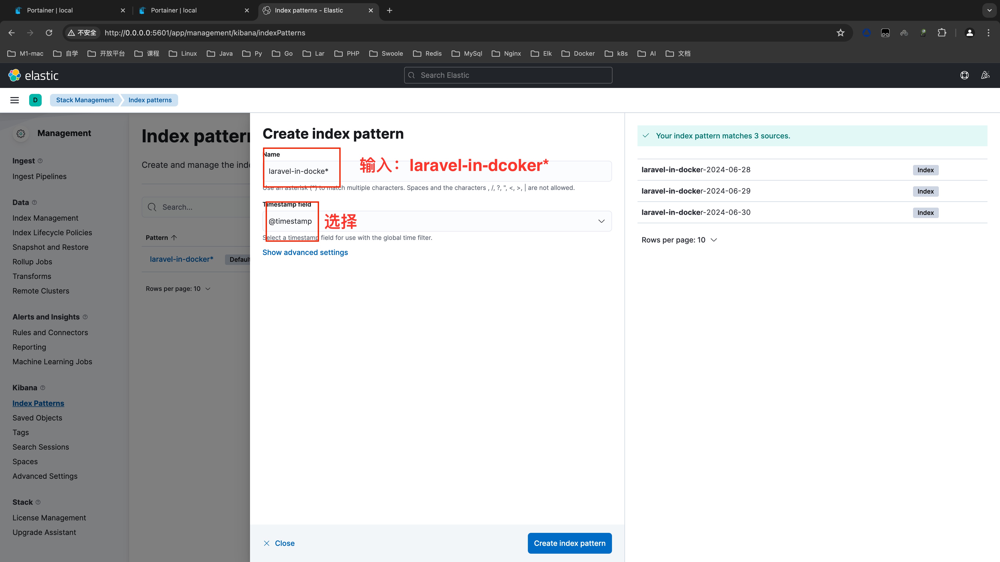


看见如下效果图，说明日志搜集服务成功


⚠️常见日志收集失败原因

- kafka中没有创建搜集日志的topic : laravel-in-docker-log

  解决:去kafka创建 laravel-in-docker-log，重启filebeat、go-stash

- 内部kafka问题

  解答:

  1）docker logs 按照顺序检查kafka、filbeat、go-stash、es的容器日志，确认服务都没问题

  2）先docker logs -f filebeat查看filebeat是否正确连接到了kafka

  3）进入kafka容器内，执行消费kafka-log消息，看看是否filebeat的消息已经发送到了kafka

  ```shell
  $ docker exec -it kafka /bin/sh
  $ cd /opt/kafka/bin
  $ ./kafka-console-consumer.sh --bootstrap-server kafka:9092 --topic laravel-in-docker-log 
  ```

  【注】如果能消费到消息，说明filebeat与kafka没问题，就去排查go-stash、es

  ​		   如果不能消费

  ​		  1）就应该是filebeat与kafka之间连接的问题，要去看下kafka的配置信息Listen是否修改了

  ​		  2）在kafka容器内部命令行使用consumer.sh消费laravel-in-docker-log，另外一个终端命令行用producer.sh给laravel-in-docker-log发送消息，如果consumer收不到，说明kafka出问题了，docker logs -f kafka看看什么问题

​	


### 九、Jaeger链路追踪

##### jaeger配置信息注意区别本地环境和容器环境


##### 项目中引入了jaeger链路追踪，新增了app/Http/Middleware/JargerMiddleware.php中间件,在Kernel.php中配置了jaeger链路追踪中间件，以达到链路追踪的效果
访问下面两个测试链接:
###### http://0.0.0.0:8899/jaeger/index
###### http://0.0.0.0:8899/jaeger/insert
访问jaeger-ui链接:
###### http://0.0.0.0:16686/search
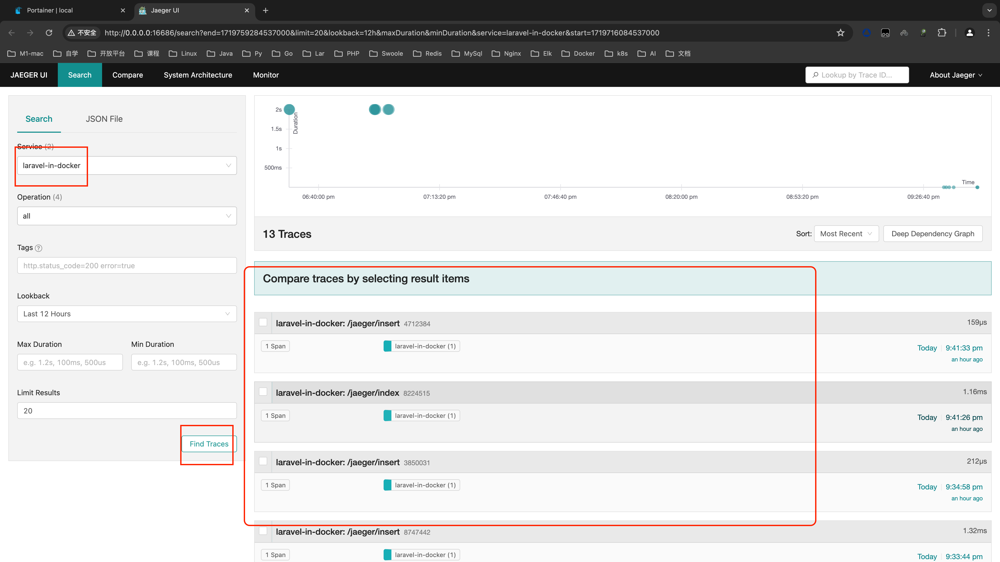


​
### 十、本项目镜像介绍

##### 由于docker访问原因，该项目用到的原镜像均已上传到个人阿里镜像仓库，所以如果拉取失败，可以自行下载到本地，然后修改docker-compose-ali-env.yml中的镜像地址

- php-fpm:php基础镜像
- nginx : 网关 （nginx->api）
- kafka : 业务使用的kafka
- zookeeper : kafka依赖的zookeeper
- redis:业务使用的redis
- mysql: 业务使用的数据库
- prometheus:监控业务
- grafana :prometheus的ui很难看，用来显示prometheus收集来的数据
- filebeat : 收集日志到kafka
- go-stash : 消费kafka中日志，脱敏、过滤然后输出到es
- elasticsearch : 存储收集的日志
- kibana : 显示elasticsearch
- jaegertracing/jaeger-query 、jaegertracing/jaeger-collector、jaegertracing/jaeger-agent:链路追踪
- go-stash : filebeat收集日志到kafka后，go-stash去消费kafka进行数据脱敏、过滤日志中内容，最后输出到es中
- xxl-job-admin :定时任务调度器
- xxl-job-executor:定时任务执行器


​
### 十一、搭建环境常见错误

```dock
1、创建阶段，起docker-compose-env.yml容器
Grafana 报错You may have issues with file permissions, more information here: http://docs.grafana.org/installation/docker/#migrate-to-v51-or-later
mkdir: can't create directory '/var/lib/grafana/plugins': Permission denied
因权限问题导致，可在docker-compose-env.yml中grafana部分加入user: root

2、filebeat容器启动报错Exiting: error loading config file: config file ("filebeat.yml") must be owned by the user identifier (uid=0) or root
因文件所有者不同导致（我在普通用户下clone的项目），filebeat的配置文件所有者必须为root，需修改sudo chown root deploy/filebeat/conf/filebeat.yml 

3、elasticsearch容器启动报错ElasticsearchException[failed to bind service]; nested: AccessDeniedException[/usr/share/elasticsearch/data/nodes];
Likely root cause: java.nio.file.AccessDeniedException: /usr/share/elasticsearch/data/nodes
报错原因es没有权限操作挂载目录，无法绑定节点，解决方法，修改权限sudo chmod 777 data/elasticsearch/data （不知道es是哪个用户启动的，所以硬改了777）

4、jaeger依赖于elasticsearch，且没有失败自动重启
```

【注】 如果是访问nginx失败，访问成功可以忽略，可能是nginx依赖后端服务，之前因为后端服务没启动起来，nginx这里没启动起来，重启一次nginx即可,项目根目录下重启

```shell
$ docker-compose restart nginx
```

​
### 十二、CI CD todo......
##### 关于该项目通过gitlab jenkins完成ci cd的配置后续时间充裕的情况下持续补充！


# 赞赏😄😂🤣


